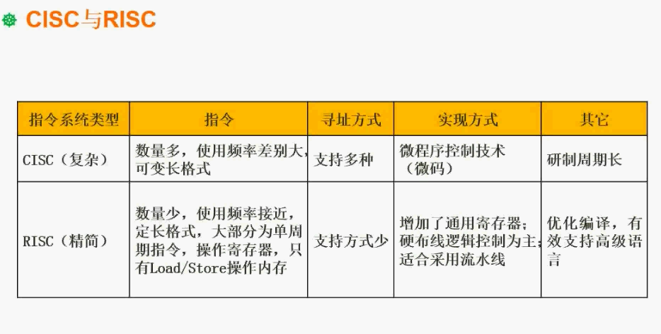
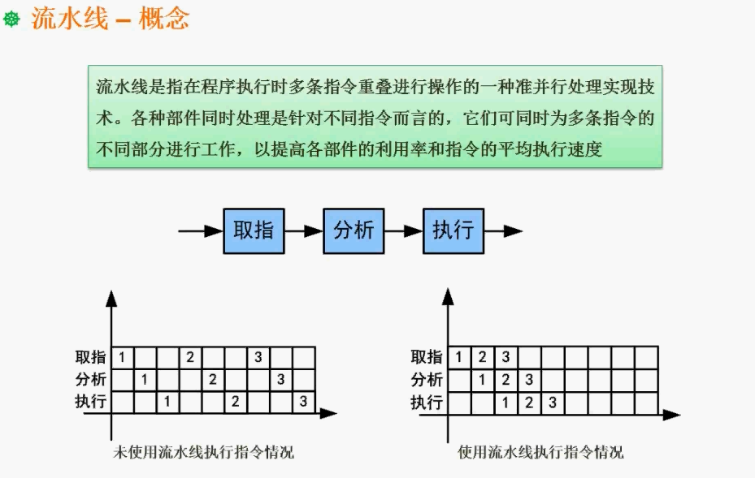
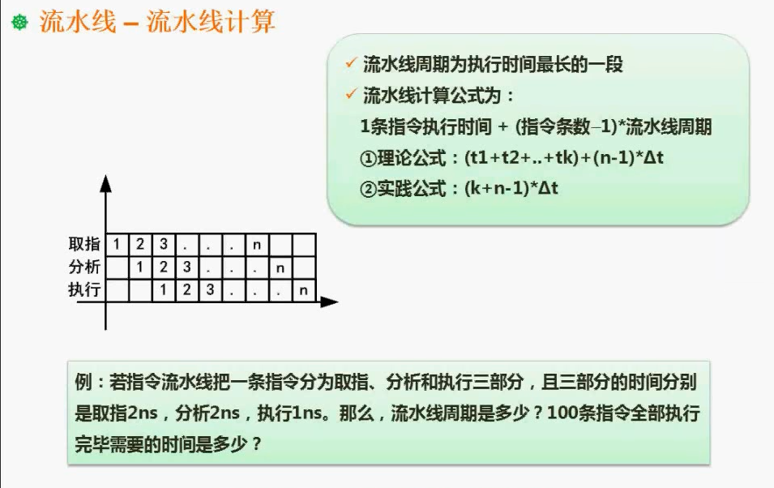

### 第一章
#### 数据的表示
**进制的转换：**
    
按权展开法，该方法通常用于低进制转高进制使用
        
            2进制转10进制
        例如：10100.01=1*2^4+0+1*2^2+0+0+0+1*2^-2 => 得到十进制数 20.25
            7进制转10进制
        例如：604.02 = 6*7^2+0+4*7^1+0+2*7^-2 得到十进制数 ...
        
短除法，该方法通常用于高进制转低进制使用

另外，二进制转八进制与十六进制数有其他方法，如下图：

**说明：**
每三位为一个十进制数

每4个为一个十进制，十进制数为超过9之后，用字母A~F顺序替代超过10的数

另外有凑数方法的计算，可以针对于高进制转低进制的转换，例：
    
    十进制的10转成2进制
    2^4 2^3 2^2 2^1 2^0
    16 8 4 2 1
    0  1 0 1 0
    选择凑数的为1，其余为0，这里只有8+2等于10，则：
    01010，可以得到二进制数为1010
    
##### 原码反码补码移码

    对于这个图，唯一想解释的点，就这个移码：
    就是首位取反，缘由为用补码表示阶码的时候，当阶码无限小，产生了下溢的时候，阶码变成了0，那么这个浮点数的值变为了1。
    而实际上这个数是无限接近于零的。那么我们就需要取出其中的 "-0“ 值作为机器零。
##### 扩展：
    阶码：
    想想10进制，125=0.125*10^3
    那么可以说任意一个J进制数N，总可以写成
              N  =   M  * J^e
    其中M是数N的尾数，M是一个纯小数
    e就是N的阶码
    J^e是比例因子
    那么这个数N的小数点位置就随着比例因子的变化而浮动，这就是浮点表示法
    阶码是浮点表示法中的概念
    增加尾数位数可提高数据精度，增加阶码位数能增大表示的数据区域

#### 数值取值范围

    
    如：一个字节用8个bit位表示，则
    原码取值范围为:
    -(2^8-1 - 1)~2^8-1 - 1 => -127~127
    反码：
    -(2^8-1 - 1)~2^8-1 - 1 => -127~127
    补码：
    -（2^8-1） ~ 2^8-1 - 1 => -128~127
    这里解释为什么补码会比原码和反码多一个bit位呢？
    我们要先区分一下原码、反码和补码的表示规则：
    
    0的表示：
    
    原码：有正零和负零之分，[+0]补=0000 0000，[-0]补=1000 0000;

    反码：同样有两种表示方法，[+0]反=0000 0000 ，[-0]反=1111 1111；

    补码：零只有一种表示方法，不分正负，[0]补=0000 0000；
    
    8为二进制表示的范围为：
          一个字节8位，如果采用原码表示正整数（含0），可以表达0-255，即 2^8=256，一共256种状态，从全0到全1的各种排列组合。如果要表示负数，则符号位需要占用一位（最高位，1代表负数，0代表正数），因此其绝对值最大范围为0-127，即2^7=128，一共正负各128种状态，如果不采用特殊处理，这时候0占用2个编码（10000000和00000000），数据表示范围为-127到-0及+0到127，这样总体上一个字节只有255种状态，因为其中0具有正0和负0之分，这不符合数学意义也浪费一个编码。
    
          除了以上的弊端，还有个原因是，早期硬件很昂贵，一位或者一个编码的浪费都是不可饶恕的，因此人们想到了另一种编码把负0利用起来，即当遇到负数时，采用补码来表示就可以解决这个问题，而遇到正数或0时还是保留原码表示。因此这个负0通过补码算法处理后自然而然地被利用起来，用来表示-128.
             补码的算法为：绝对值的原码各位取反后加1.
            例1：负1的补码：
            绝对值的8位原码为00000001
            取反：11111110
            加1 ：11111111
            此时最高位被处理为1，满足高位为1代表负数的定义。
            例2：负128的补码：
            绝对值的8位原码为10000000
            取反：01111111
            加1 ：10000000
    此时同样的最高位被置为1，同样满足高位为1代表负数的定义,同时原先表示负0的编码被利用起来表示-128。
    因此一个字节的有符号整数范围为-128到127。
    综上为：
         原码+反码：8位原码和反码能够表示数的范围是-127~127；
    
         补码：8位补码能够表示数的范围是 -128~127。
    
         （在补码中用(-128)代替了(-0)，所以补码的表示范围为：(-128~0~127)共256个

### 浮点数的运算

    举个例子：
    首先1000 = 1.0*10^3，119 = 1.19*10^2
    那么两个浮点数相加，首先需要对阶
    e指数相等，且优先小化大，及1.19*10^2 化为 0.119*10^3 而不是10.0 * 10^2这样子，主要目的也是为了方便计算
    对阶完成之后就是，尾数计算，及相加之后为：1.119*10^2 这样的形式
    最后就是结果格式化，还是为1.119*10^2。
    要求：尾数必须大于0，且小于10

### 计算机结构

    
    详述如下：
        下面我们要看到的，是计算机结构当中的主机的基本构成，我们知道主机是属于计算机当中的核心部分，整个计算机的组成呢，
        就是主机加外设，那主机是不是就是我们平常所说的主机箱里面的一些部件呢？不是这么回事，我们讲到的计算机结构里面的主机，
        远比我们所接触到的，主机箱里面的部件要少，主机只包括两个部分是CPU，另外一个部分就是内存，也称为主存储器，
        这一点概念呢是需要明确的，你像硬盘，像什么声卡，显卡这些东西呢，都归为外设，只有两大部件是属于主机的，在这个结构当中，
        我们要特别注意的一点是CPU里面的运算器和控制器，因为在考试当中运算器和控制器构成，是经常考到的一个知识点，
        运算器也成为了算术逻辑单元，alu运算器，它的基本的思想或者说基本所做的工作是做预算的职能，你比如说要做一些加法减法这些东西呢，
        在运算器里面去做，但是CPU当中仅仅有运算职能部件还不够，还要去控制这个部件的相关的运作，控制整个CPU的一些交互什么之类的，
        那这个职能呢，就是由控制器来完成的，所以从整体上面来讲，我们会发现运算器里面所包含的一些内容主要是什么呢？
        算术逻辑单元这基本上呢，一眼就能够识别它跟运算相关，累加寄存器AC，听这个名词了，感觉他是做加法运算的，但事实上呢，
        它是一个通用的寄存器，就是运算的过程中，他去存一些需要运算的，相应的值的时候会要用到它，它不仅仅是加法减法运算，
        也会用到AC这样的计算器，第3个呢是数据缓冲寄存器，数据缓冲寄存器了，它是用来做什么的？就是我们在对内存储器进行读写操作的时候，
        用来暂存数据的，这样的计算器，第4个是状态条件寄存器，PSW这个非常具有特色，所以呢，经常考到，它是用来存储在运算的过程中的相关
        的标志位的，何谓标志位？为了你比如说运算有的时候涉及到境内，有些运算呢，会溢出，然后还有什么中断，等等，会涉及到一些状态的，
        信息需要保存，这就是存在PSW里面，控制器里面也会有多个相应的部件，控制器里面的部件呢，也比较好识别，你像第1类的是跟指令相关的，
        指令的寄存器l指令的译码器这些部件，因为你看到指令你就会想到，我们是在运行程序的时候，我们要调取相应的一些内容，
        调取相应的一些指令代码的内容的时候呢，就需要去控制，所以呢，指令相关的往往是和在控制器里面部件和控制项目。程序计数器是什么东西了？
        我们在进行程序运行的时候，运行了当前指令，只要运行，接下来要运行下一条指令，那运行下一条指令的时候我们需要了解下一条指令在什么位置，
        这就是由程序计数器PC，来完成的，如果说仅仅只是顺序执行，那你就在原地址的基础上去家，比如说加1，就得到了新地，
        如果说涉及到跳转的就加的幅度了，再大一些，仅此而已啊，另外一点呢就是时序部件，这是运算器和控制器，对于他常用的这一系列的寄存器，
        我们需要了解它的基本职能，哪些东西是属于运算器的部分？哪些东西又是属于控制器的部分？

### Flynn 分类法
    
    详述：
     这种分类法是针对于计算机体系结构的一种分类，如下图：

### CISC和RISC

    
    CISC和RISC
    这系统的指令的数量大片，CISC和RISC，这个知识点，考查频度了也比较高，这知识点考察的时候基本上呢，就是一种形式，
    给出a,b,c,d4个选项对于CISC和RISC的描述，然后呢，让大家来选择，哪些说法是对的？哪个说法是对的？或者说哪个说法是错误的，
    或者说呢，就直接问以下哪一个不是CISC的特点或哪一个不是RISC的特点，基本的考察形式就是如此，要求我们掌握什么，掌握这一页PPT里面，
    两种不同指令类型的一个区别比较哈，对于里面的这些内容，竟然是让大家记得，我就不详细一个一个去念出来，我在这里想讲的是什么问题的，
    就是大家如何去理解，何以变得能够很顺利的去把这一个表中的内容给它记下来1是以前提出来的一种比较常用的指令系统，什么环境下提出来的呢？
    计算机还没有大规模的通用化的时候提出来，在这个时候，计算机属于奢侈品，比如说一个机构要需要一台计算机，在这个时候我们需要怎么做呢？
    需要找到厂商来为我们定制一台计算机，这台计算机从硬件到指令系统都是定制的，你比如说这台计算机用来处理天气预报的信息，
    那就会根据需要的运算能力来设计这台计算机，这台计算机呢，可能不是我们所看到的笔记本的大小，也不是台式机的大小，而是一间房子那么大，
    很多元器件组装起来的，然后呢，你要进行什么样的业务处理，就给你设计哪些指令，然后呢，再在指令基础之上编程去完成业务指标，
    这还是很多年前的事情，有了这样的一种历史背景和环境之后，我们就能够理解，为什么dsp成为复杂，是因为这种指令系统，
    根据不同的用户会做不同的职业，而且呢，数量会相当多，指令本身的系统很复杂，数量多，号在计算机发展的历程中，原来，
    基本上都是各个单位的专用设备，后来计算机的成为了通用设备，每一个机构买一台计算机回去，装上软件就想直接跑，所以说了，
    人们就要考虑把这一个计算机的指令系统呢给它简化，让他的适应力更强一些，而且呢要做优化，那这个时候我们呢，就开始把繁杂的指令系统开始简化，
    简化到最基本的操作，然后复杂一点的操作了，都用基本的操作来替代，比如说一个乘法指令，做一个简单的一个比喻啊，就是一个乘法指令，
    如果说我们觉得它比较复杂，而我呢，就不要把他排除出去，只留下加法指令，把乘法了看成多个家访指令的累加，这样的形式来完成，大大的降低了，
    整个系统的指令的数量，所以呢叫精简，就是这样的一个情况，所以呢，我们再来看表中的一些内容，就会比较好理解，你看指定数量。那毫无疑问，
    是复杂指令集会多吗？很多的指令，那有些指令呢，可能是频繁要用到的，就是那些简单一点的，要么复杂的一些指令的部件得了，使用频度很高，
    这也就是为什么要把一些复杂的指令把它排除掉的原因，使用频度比较差别比较大，一般都是用可变长的这种指令，就是我们指令，
    在系统当中会有一个二进制的编码，编码的长度可以不同，而指定的数量少，也比较接近，就用定长格式，就所有的指令，它的长度是一样的，
    这是这样的一个情况，同时呢精简指令集呢，为了提升效率，所以说，大量的引入了寄存器，绝大部分操作都是针对寄存器来操作的，
    那为什么要针对计算机操作，是因为寄存器速度极快，效率极高，后面呢我们会讲到寄存器只有了这个LOAD和这个storage就是一个是读取，
    一个是存入来操作了内存，其他的都读取寄存器，所以呢得到了比较高的效率，寻址方式方面精简指令集也大大的减少，然后呢，
    它会考虑用一些硬布线的逻辑控制为主，因为硬部件有什么好处就是效率高吗？软硬件对比的话，硬件呢，一般呢，你要去设计，
    它的复杂度会比较高，就是比较难设计出来，但是一旦设计出来了，它的效率比软件实现同样的功能要更高效更快，更加适合于流水线，
    也支持了高级程序，现在来讲这种精简指令集数量上会大大的超越复杂指令集，它是主流，这是这样的一个情况，所以呢，两者的区别请大家一定要掌握好。
   
### 流水线

#### 流水线计算

    从图中可以看出第一条执行开始执行，即如下图：
    1 2 3...
      1 2...
        1...
    前面这一段为流水建立起来的时间，后面则按规律执行。
    这个建立起来的时间为一周期，这一个周期的时间为中，
    有三个阶段，最长的阶段为该流水的周期时间，在这里这个为2ns
    一百个指令：
    这个是按理论公式计算得出：
        （2+2+1）+（100-1）*2 = 203ns
    另外实践公式：
        k为分了几段 n指令数量 
        (3+100-1)*2 = 204ns
    
    
    

    

    
    
    
    
