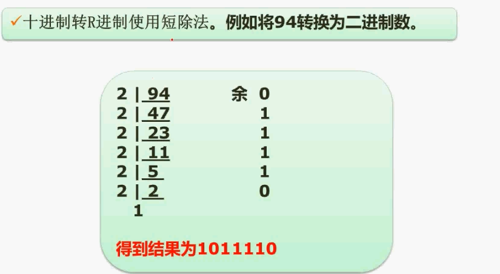
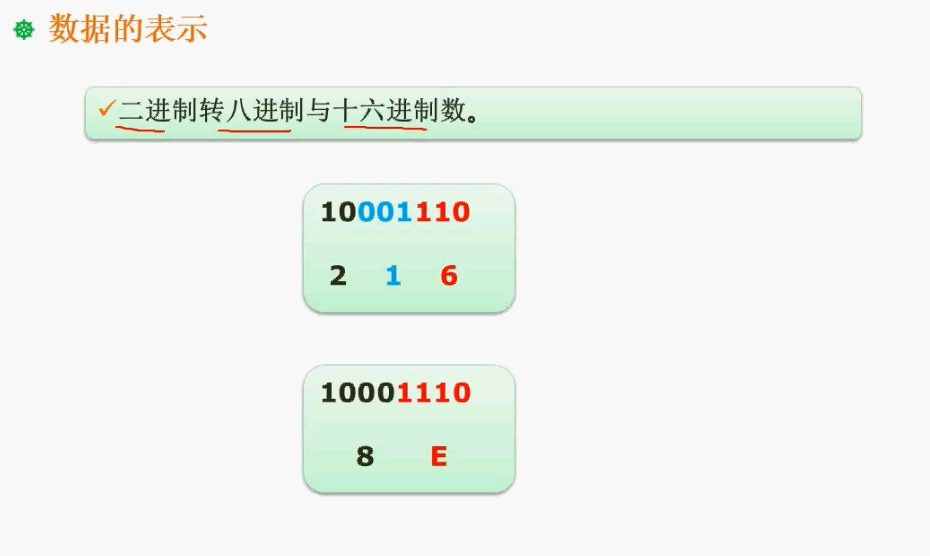
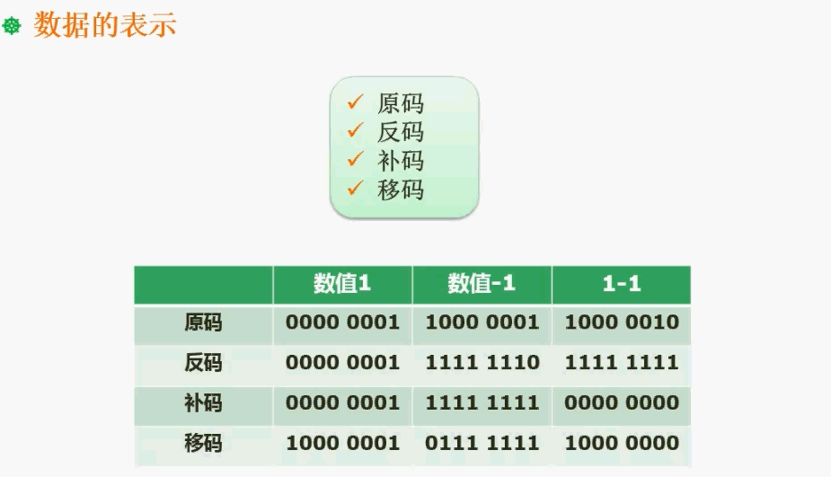
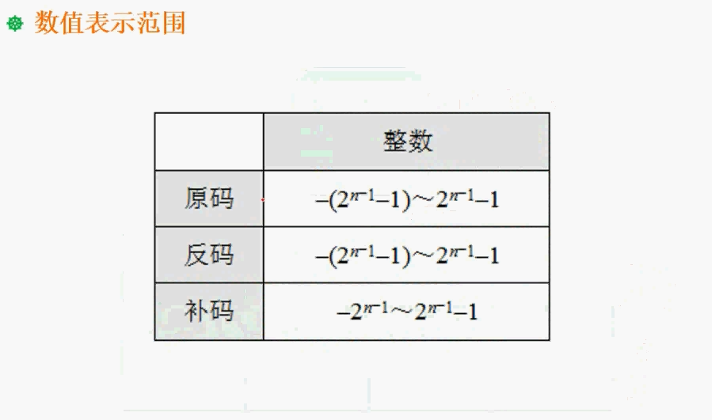
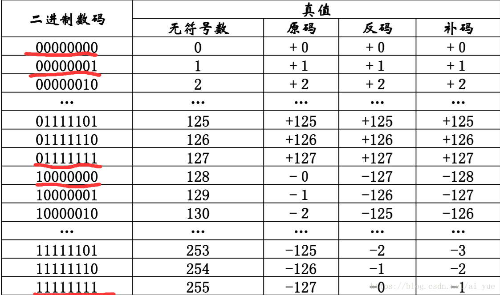

###第一章
####**数据的表示**
**进制的转换：**
    
按权展开法，该方法通常用于低进制转高进制使用
        
            2进制转10进制
        例如：10100.01=1*2^4+0+1*2^2+0+0+0+1*2^-2 => 得到十进制数 20.25
            7进制转10进制
        例如：604.02 = 6*7^2+0+4*7^1+0+2*7^-2 得到十进制数 ...
        
短除法，该方法通常用于高进制转低进制使用

另外，二进制转八进制与十六进制数有其他方法，如下图：

**说明：**
每三位为一个十进制数

每4个为一个十进制，十进制数为超过9之后，用字母A~F顺序替代超过10的数

另外有凑数方法的计算，可以针对于高进制转低进制的转换，例：
    
    十进制的10转成2进制
    2^4 2^3 2^2 2^1 2^0
    16 8 4 2 1
    0  1 0 1 0
    选择凑数的为1，其余为0，这里只有8+2等于10，则：
    01010，可以得到二进制数为1010
    
#####原码反码补码移码

    对于这个图，唯一想解释的点，就这个移码：
    就是首位取反，缘由为用补码表示阶码的时候，当阶码无限小，产生了下溢的时候，阶码变成了0，那么这个浮点数的值变为了1。
    而实际上这个数是无限接近于零的。那么我们就需要取出其中的 "-0“ 值作为机器零。
##### 扩展：
    阶码：
    想想10进制，125=0.125*10^3
    那么可以说任意一个J进制数N，总可以写成
              N  =   M  * J^e
    其中M是数N的尾数，M是一个纯小数
    e就是N的阶码
    J^e是比例因子
    那么这个数N的小数点位置就随着比例因子的变化而浮动，这就是浮点表示法
    阶码是浮点表示法中的概念
    增加尾数位数可提高数据精度，增加阶码位数能增大表示的数据区域

#### 数值取值范围

    
    如：一个字节用8个bit位表示，则
    原码取值范围为:
    -(2^8-1 - 1)~2^8-1 - 1 => -127~127
    反码：
    -(2^8-1 - 1)~2^8-1 - 1 => -127~127
    补码：
    -（2^8-1） ~ 2^8-1 - 1 => -128~127
    这里解释为什么补码会比原码和反码多一个bit位呢？
    我们要先区分一下原码、反码和补码的表示规则：
    
    0的表示：
    
    原码：有正零和负零之分，[+0]补=0000 0000，[-0]补=1000 0000;

    反码：同样有两种表示方法，[+0]反=0000 0000 ，[-0]反=1111 1111；

    补码：零只有一种表示方法，不分正负，[0]补=0000 0000；
    
    8为二进制表示的范围为：
          一个字节8位，如果采用原码表示正整数（含0），可以表达0-255，即 2^8=256，一共256种状态，从全0到全1的各种排列组合。如果要表示负数，则符号位需要占用一位（最高位，1代表负数，0代表正数），因此其绝对值最大范围为0-127，即2^7=128，一共正负各128种状态，如果不采用特殊处理，这时候0占用2个编码（10000000和00000000），数据表示范围为-127到-0及+0到127，这样总体上一个字节只有255种状态，因为其中0具有正0和负0之分，这不符合数学意义也浪费一个编码。
    
          除了以上的弊端，还有个原因是，早期硬件很昂贵，一位或者一个编码的浪费都是不可饶恕的，因此人们想到了另一种编码把负0利用起来，即当遇到负数时，采用补码来表示就可以解决这个问题，而遇到正数或0时还是保留原码表示。因此这个负0通过补码算法处理后自然而然地被利用起来，用来表示-128.
             补码的算法为：绝对值的原码各位取反后加1.
            例1：负1的补码：
            绝对值的8位原码为00000001
            取反：11111110
            加1 ：11111111
            此时最高位被处理为1，满足高位为1代表负数的定义。
            例2：负128的补码：
            绝对值的8位原码为10000000
            取反：01111111
            加1 ：10000000
    此时同样的最高位被置为1，同样满足高位为1代表负数的定义,同时原先表示负0的编码被利用起来表示-128。
    因此一个字节的有符号整数范围为-128到127。
    综上为：
         原码+反码：8位原码和反码能够表示数的范围是-127~127；
    
         补码：8位补码能够表示数的范围是 -128~127。
    
         （在补码中用(-128)代替了(-0)，所以补码的表示范围为：(-128~0~127)共256个

    
    
    
    
